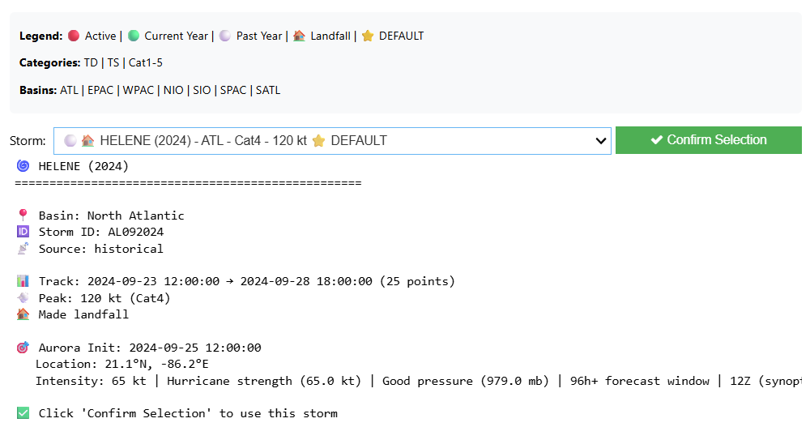

# 🌀 Aurora MPC Workflow: Hurricane Path Prediction & Infrastructure Impact Analysis

This repository demonstrates an end-to-end workflow for hurricane path prediction and infrastructure impact analysis using **[Microsoft Planetary Computer Pro](https://azure.microsoft.com/en-us/products/planetary-computer-pro)** and the **Aurora AI weather foundation model**.

## 🎬 Demo

## Sample Output
Running the notebook in this project produces an interactive map that allows users to explore the results of the  storm forecast locally. Download a prerendered, sample of this interactive map, produced for Atlantic hurricane Helene from 2024 here:


📥 [Download the interactive map](https://github.com/Azure/microsoft-planetary-computer-pro/releases/tag/storm_impact_assessment) to explore the results locally.

## 🎯 Main Notebook

**[hurricane_forecast_infra_impact.ipynb](hurricane_forecast_infra_impact.ipynb)** - An interactive workflow that showcases:

- 🌐 **Planetary Computer Pro** - Unified STAC catalog for geospatial data access
- 🌪️ **Aurora AI Model** - State-of-the-art weather prediction via Microsoft Foundry
- ⚡ **Infrastructure Analysis** - Power grid impact assessment using OpenStreetMap
- 🗺️ **Interactive Visualization** - Storm tracks and affected infrastructure maps

The notebook works with **both historical or active tropical storm** from the IBTrACS database. Hurricane Helene (2024) is pre-selected as the default for a ready-to-run experience. You can select a different storm using the interactive widget generated in **Section 2 — Storm Selection** of the notebook:



## 📋 Workflow Overview

| Step | Description |
|------|-------------|
| 1. **Environment Setup** | Configure Azure credentials and service connections |
| 2. **Storm Selection** | Choose any storm from IBTrACS or use active storm feeds |
| 3. **ECMWF Data Download** | Retrieve weather data via Planetary Computer Pro STAC API |
| 4. **Aurora Batch Preparation** | Format data for model inference |
| 5. **Aurora Inference** | Run hurricane predictions on Microsoft Foundry |
| 6. **Track Visualization** | Compare predicted vs observed storm paths |
| 7. **Infrastructure Analysis** | Identify power grid assets in the storm's path |

## 🛠️ Prerequisites

- **Python 3.10 – 3.13**
- **Azure Subscription** with access to:
  - Microsoft Planetary Computer Pro (GeoCatalog) — available in supported regions: `northcentralus`, `eastus`, `canadacentral`, `westeurope`, or `uksouth`
  - Microsoft Foundry (Aurora model endpoint) — requires GPU compute quota (e.g., `Standard_NC24ads_A100_v4`)
  - Azure Blob Storage

## 🚀 Quick Start

1. **Clone the repository**
   ```bash
   git clone https://github.com/Azure/microsoft-planetary-computer-pro.git
   cd microsoft-planetary-computer-pro/applications/storm_impact_assessment
   ```

2. **Install dependencies**
   ```bash
   pip install -r requirements.txt
   ```

3. **Configure credentials**
   
   Copy `.env.example` to `.env` and fill in your credentials:
   ```
   # GeoCatalog base URI (the notebook appends /stac and other API suffixes)
   GEOCATALOG_URI=https://your-geocatalog.your-region.geocatalog.spatio.azure.com
   
   # Aurora Model Configuration
   AURORA_FOUNDRY_ENDPOINT=https://your-aurora-endpoint.your-region.inference.ml.azure.com/score
   AURORA_FOUNDRY_TOKEN=<your-token>
   
   # Azure Blob Storage
   AURORA_BLOB_STORAGE_SAS=https://youraccount.blob.core.windows.net/container?your_sas_token
   UPLOAD_CONTAINER_NAME=model-outputs
   STORAGE_ACCOUNT_KEY=<your-storage-key>
   ```

4. **Run the notebook**
   
   Open `hurricane_forecast_infra_impact.ipynb` and execute cells sequentially.

## 📦 Key Dependencies

| Package | Purpose |
|---------|---------|
| `microsoft-aurora` | Aurora AI weather model SDK |
| `azure-planetarycomputer` | Planetary Computer Pro SDK |
| `pystac-client` | STAC API client |
| `tropycal` | Tropical cyclone data & analysis |
| `xarray` / `cfgrib` / `netcdf4` | Multi-dimensional weather data |
| `cartopy` | Geospatial visualization |
| `ipyleaflet` / `ipywidgets` | Interactive maps |
| `azure-identity` / `azure-storage-blob` | Azure authentication & storage |

## 📁 Project Structure

```
├── hurricane_forecast_infra_impact.ipynb  # Main workflow notebook
├── requirements.txt                        # Python dependencies
├── .env.example                            # Environment template
├── deploy/                                 # Azure deployment templates
│   └── azuredeploy.json                    # ARM template
├── scripts/                                # Helper scripts
│   └── nb_edit.py                          # Notebook editor (see below)
├── docs/                                   # Documentation
│   ├── ARCHITECTURE.md                     # Architecture overview
│   └── IMPACT_SWATH_ALGORITHM.md           # Swath algorithm reference
├── outputs/                                # Model outputs and results
├── cache/                                  # Cached API responses
└── downloads/                              # Downloaded GRIB2 data files
```

## 🧰 Developer Tools

The main notebook is large (~1.5 MB, 71 cells, ~19K JSON lines) which can make editing slow in VS Code's diff editor. Two helpers are included to streamline development:

- **`scripts/nb_edit.py`** — A CLI tool for reading, searching, and editing the notebook directly on its JSON structure, bypassing VS Code's diff editor. Supports cell read/search/replace, line-range edits, insert/delete, and output clearing. Run `python scripts/nb_edit.py --help` for usage.
- **`.github/copilot-instructions.md`** — Provides GitHub Copilot (and similar AI assistants) with project context, a cell-by-cell index of the notebook, and instructions to use `nb_edit.py` for edits instead of the built-in notebook tools.

## 🌐 Data Sources

| Source | Data Type |
|--------|-----------|
| **IBTrACS / HURDAT** | Historical tropical cyclone tracks |
| **ECMWF HRES** | Weather forecast data (via MPC) |
| **OpenStreetMap** | Power infrastructure data |
