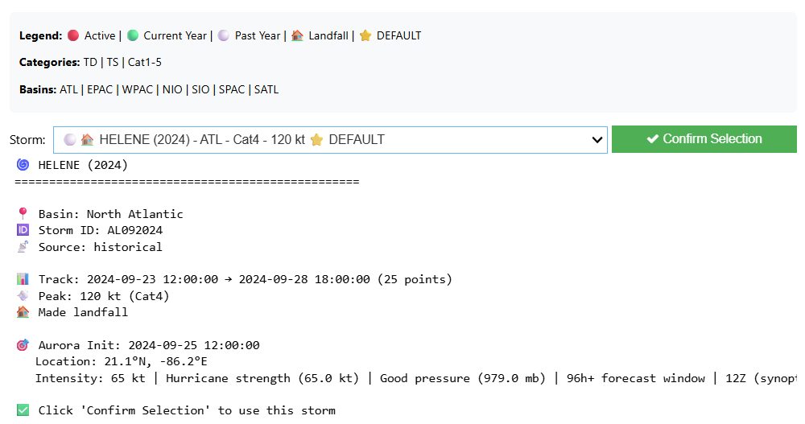

# 🌀 Aurora MPC Workflow: Hurricane Path Prediction & Infrastructure Impact Analysis

This repository demonstrates an end-to-end workflow for hurricane path prediction and infrastructure impact analysis using **[Microsoft Planetary Computer Pro](https://azure.microsoft.com/en-us/products/planetary-computer-pro)** and the **Aurora AI weather foundation model**.

## 🎬 Demo

## Sample Output
Running the notebook in this project produces an interactive map that allows users to explore the results of the  storm forecast locally. Download a prerendered, sample of this interactive map, produced for Atlantic hurricane Helene from 2024 here:


📥 [Download the interactive map](https://github.com/Azure/microsoft-planetary-computer-pro/releases/tag/storm_impact_assessment) to explore the results locally.

### Opening exported maps without an API key

New exports use **OpenFreeMap Positron**, a light-gray OpenStreetMap-based
street map that keeps storm and infrastructure overlays prominent. Double-click
the HTML file to open it in a browser: no API key, Python process, or local web
server is required. A **WebGL-enabled browser** and internet access are needed
for the vector tiles, fonts, and Leaflet/MapLibre libraries. Storm tracks, impact zones, and infrastructure are
embedded in the HTML; opening the map does not run Aurora or query Azure.
GeoCatalog links still require the viewer's own Azure access.

CARTO now requires a key for the raster tiles used by older exports. Its
unauthenticated response can be an HTTP 200 image saying **API KEY REQUIRED**,
not an HTTP error. To repair an older export, including the released Helene
sample, run this from the application directory:

```powershell
python scripts\basemap.py "hurricane_helene_2024_infrastructure_impact.html" "hurricane_helene_2024_infrastructure_impact_positron.html"
```

The original file is preserved, and forecasts do not need to be rerun.
The repair command expects the original CARTO-based export, not a previously
repaired NASA or OpenFreeMap copy. The full infrastructure layers, controls,
and animation remain unchanged. The renderer is pinned to MapLibre GL JS
5.24.0 and MapLibre GL Leaflet 0.1.4. If the renderer or map requests fail,
the page displays an error instead of silently switching to another provider.

[OpenFreeMap](https://openfreemap.org/) permits commercial use of its public
service without an API key, but offers **no SLA**. Network restrictions,
service outages, or future provider policy changes can affect the background.
This uses OpenFreeMap's vector service, not the public OpenStreetMap raster
tile server, whose web-referrer requirement does not fit the `file://` workflow.
See also [CARTO's key requirement](https://docs.carto.com/faqs/carto-basemaps).

**Keep the linked attribution visible:** OpenMapTiles and OpenStreetMap
contributors are credited on the map, alongside OpenFreeMap and a link to
the style credits. OSM data is licensed under **ODbL 1.0**. Positron's design
uses **CC BY 4.0**, with upstream CARTO/Stamen/Paul Norman design credits under
**CC BY 3.0**; see the [complete license notices](https://github.com/hyperknot/openfreemap/blob/main/LICENSE.md).
If you redistribute adapted OSM infrastructure datasets, ODbL share-alike
obligations may apply independently of the basemap. Displaying the map does
not automatically put the notebook's code under ODbL. Preserve applicable
library and style notices when redistributing their code.

## 🎯 Main Notebook

**[hurricane_forecast_infra_impact.ipynb](hurricane_forecast_infra_impact.ipynb)** - An interactive workflow that showcases:

- 🌐 **Planetary Computer Pro** - Unified STAC catalog for geospatial data access
- 🌪️ **Aurora AI Model** - State-of-the-art weather prediction via Microsoft Foundry
- ⚡ **Infrastructure Analysis** - Power grid impact assessment using OpenStreetMap
- 🗺️ **Interactive Visualization** - Storm tracks and affected infrastructure maps

The notebook works with **both historical or active tropical storm** from the IBTrACS database. Hurricane Helene (2024) is pre-selected as the default for a ready-to-run experience. You can select a different storm using the interactive widget generated in **Section 2 — Storm Selection** of the notebook:



## 📋 Workflow Overview

| Step | Description |
|------|-------------|
| 1. **Environment Setup** | Configure Azure credentials and service connections |
| 2. **Storm Selection** | Choose any storm from IBTrACS or use active storm feeds |
| 3. **ECMWF Data Download** | Retrieve weather data via Planetary Computer Pro STAC API |
| 4. **Aurora Batch Preparation** | Format data for model inference |
| 5. **Aurora Inference** | Run hurricane predictions on Microsoft Foundry |
| 6. **Track Visualization** | Compare predicted vs observed storm paths |
| 7. **Infrastructure Analysis** | Identify power grid assets in the storm's path |

## 🛠️ Prerequisites

- **Python 3.10 – 3.13**
- **Azure Subscription** with access to:
  - Microsoft Planetary Computer Pro (GeoCatalog) — available in supported regions: `northcentralus`, `eastus`, `canadacentral`, `westeurope`, or `uksouth`
  - Microsoft Foundry (Aurora model endpoint) — requires GPU compute quota (e.g., `Standard_NC24ads_A100_v4`)
  - Azure Blob Storage

## 🚀 Quick Start

1. **Clone the repository**
   ```bash
   git clone https://github.com/Azure/microsoft-planetary-computer-pro.git
   cd microsoft-planetary-computer-pro/applications/storm_impact_assessment
   ```

2. **Install dependencies**
   ```bash
   python -m pip install --no-cache-dir -r requirements.txt
   ```

   Install into the same environment selected as the notebook kernel. On Windows
   ARM devices, use **x64 Python** if the configured package feed does not provide
   ARM64 builds of dependencies such as `torch`. For example, with x64 Python 3.12
   installed, run from this application directory:

   ```powershell
   py -3.12 -c "import sysconfig; print(sysconfig.get_platform())"
   # Confirm win-amd64 above before creating the environment.
   py -3.12 -m venv .venv
   .\.venv\Scripts\python.exe -m pip install --no-cache-dir -r requirements.txt
   ```

   In VS Code, select `.venv\Scripts\python.exe` using the notebook's kernel picker.
   The first code cell also installs requirements, displays pip output, and stops
   with an error if installation fails. Restart the kernel **only after success**.
   A persistent hash mismatch with the cache disabled requires checking the
   configured feed or proxy; do not disable hash verification or replace hashes.

3. **Configure credentials**
   
   Copy `.env.example` to `.env` and fill in your credentials:
   ```
   # GeoCatalog base URI (the notebook appends /stac and other API suffixes)
   GEOCATALOG_URI=https://your-geocatalog.your-region.geocatalog.spatio.azure.com
   
   # Aurora Model Configuration
   AURORA_FOUNDRY_ENDPOINT=https://your-aurora-endpoint.your-region.inference.ml.azure.com/score
   AURORA_FOUNDRY_TOKEN=<your-token>
   
   # Azure Blob Storage
   AURORA_BLOB_STORAGE_SAS=https://youraccount.blob.core.windows.net/container?your_sas_token
   UPLOAD_CONTAINER_NAME=model-outputs
   STORAGE_ACCOUNT_KEY=<your-storage-key>
   ```

4. **Run the notebook**
   
   Open `hurricane_forecast_infra_impact.ipynb` and execute cells sequentially.

## 📦 Key Dependencies

| Package | Purpose |
|---------|---------|
| `microsoft-aurora` | Aurora AI weather model SDK |
| `azure-planetarycomputer` | Planetary Computer Pro SDK |
| `pystac-client` | STAC API client |
| `tropycal` | Tropical cyclone data & analysis |
| `xarray` / `cfgrib` / `netcdf4` | Multi-dimensional weather data |
| `cartopy` | Geospatial visualization |
| `ipyleaflet` / `ipywidgets` | Interactive maps |
| `folium` | Standalone HTML maps with OpenFreeMap Positron |
| `azure-identity` / `azure-storage-blob` | Azure authentication & storage |

## 📁 Project Structure

```
├── hurricane_forecast_infra_impact.ipynb  # Main workflow notebook
├── requirements.txt                        # Python dependencies
├── .env.example                            # Environment template
├── deploy/                                 # Azure deployment templates
│   └── azuredeploy.json                    # ARM template
├── scripts/                                # Helper scripts
│   ├── nb_edit.py                          # Notebook editor (see below)
│   └── basemap.py                          # No-key basemap and HTML export repair
├── tests/                                  # Basemap and notebook setup regression tests
├── docs/                                   # Documentation
│   ├── ARCHITECTURE.md                     # Architecture overview
│   └── IMPACT_SWATH_ALGORITHM.md           # Swath algorithm reference
├── outputs/                                # Model outputs and results
├── cache/                                  # Cached API responses
└── downloads/                              # Downloaded GRIB2 data files
```

## 🧰 Developer Tools

The main notebook is large (~1.5 MB, 71 cells, ~19K JSON lines) which can make editing slow in VS Code's diff editor. Two helpers are included to streamline development:

- **`scripts/nb_edit.py`** — A CLI tool for reading, searching, and editing the notebook directly on its JSON structure, bypassing VS Code's diff editor. Supports cell read/search/replace, line-range edits, insert/delete, and output clearing. Run `python scripts/nb_edit.py --help` for usage.
- **`.github/copilot-instructions.md`** — Provides GitHub Copilot (and similar AI assistants) with project context, a cell-by-cell index of the notebook, and instructions to use `nb_edit.py` for edits instead of the built-in notebook tools.

## 🌐 Data Sources

| Source | Data Type |
|--------|-----------|
| **IBTrACS / HURDAT** | Historical tropical cyclone tracks |
| **ECMWF HRES** | Weather forecast data (via MPC) |
| **OpenStreetMap** | Power infrastructure data |
