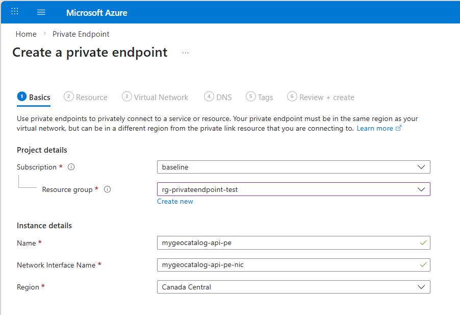
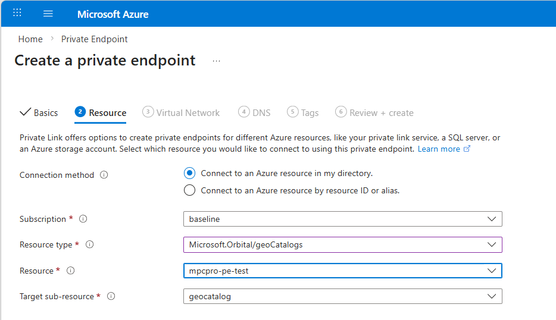
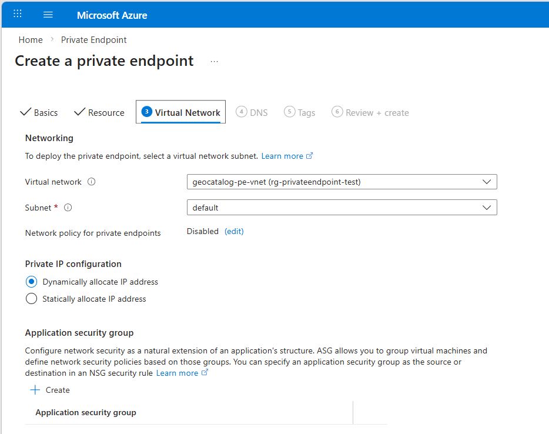
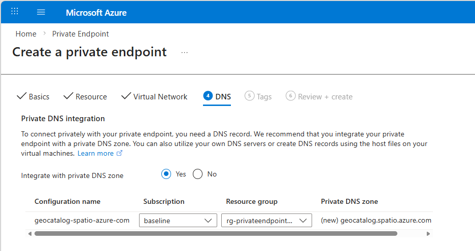
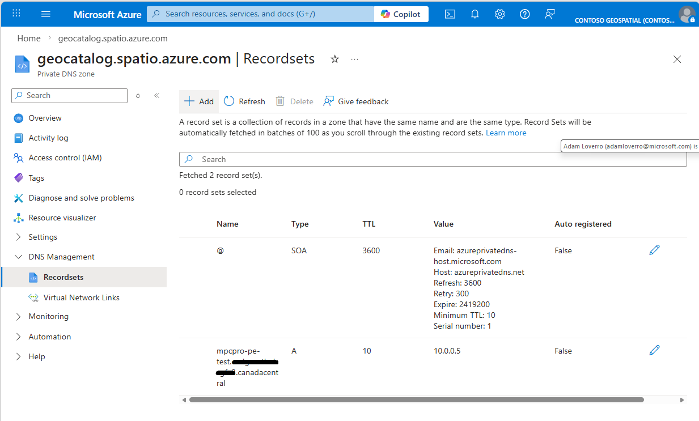

# Configure a private endpoint for GeoCatalog data plane APIs

This article walks you through creating a private endpoint that connects your virtual network to the GeoCatalog data plane APIs. After configuration, all GeoCatalog data plane API requests from your virtual network travel over a private connection instead of the public internet.

Optionally, you can also disable public network access so the GeoCatalog APIs are only reachable from your virtual network.

> [!NOTE]
> Private Link for GeoCatalog is currently in private preview.

## Prerequisites

- An existing [GeoCatalog resource](./deploy-geocatalog-resource.md)
- A virtual network with at least one subnet
- **GeoCatalog Admin** role on the GeoCatalog resource
- `Microsoft.Orbital` provider registered in your subscription
- Azure CLI (for the CLI steps)

> [!NOTE]
> Configuring Private Link with Azure CLI is required during the private preview period as some Private Link features are not availabe through Azure Portal.

## Create the private endpoint

# [Azure portal](#tab/portal)

1. In the Azure portal, search for **Private endpoints** and select **Create**.

2. On the **Basics** tab:
   - Select your **Subscription** and **Resource group**.
   - Enter a **Name** for the private endpoint, for example: `mygeocatalog-api-pe`.
   - Select the **Region** that matches your virtual network.

   [  ](media/create-data-plane-private-endpoint-basics.png#lightbox)

3. On the **Resource** tab:
   - For **Resource type**, select **Microsoft.Orbital/geoCatalogs**.
   - For **Resource**, select your GeoCatalog.
   - For **Target sub-resource**, select **geocatalog**.

   [  ](media/create-data-plane-private-endpoint-resource.png#lightbox)

4. On the **Virtual Network** tab:
   - Select the **Virtual network** and **Subnet** where the private endpoint should be created.
   - Leave **Private IP configuration** set to **Dynamically allocate IP address**.

   [  ](media/create-data-plane-private-endpoint-virtualnetwork.png#lightbox)

5. On the **DNS** tab:
   - Set **Integrate with private DNS zone** to **Yes**.
   - Verify the private DNS zone is set to `geocatalog.spatio.azure.com`.

   > [!NOTE]
   > During private preview, automatic DNS integration may not create the A record for GeoCatalog. If DNS resolution doesn't work after the endpoint is created, follow the manual DNS setup in the next section.

   [  ](media/create-data-plane-private-endpoint-dns.png#lightbox)

6. Select **Review + create**, then select **Create**.

For same-region endpoints where you have the GeoCatalog Admin role, the connection is automatically approved. Cross-region or cross-tenant endpoints may require manual approval.

# [Azure CLI](#tab/cli)

### Create the private endpoint

```bash
# Set variables
SUBSCRIPTION_ID="<your-subscription-id>"
RESOURCE_GROUP="<your-resource-group>"
GEOCATALOG_NAME="<your-geocatalog-name>"
VNET_NAME="<your-vnet-name>"
SUBNET_NAME="<your-subnet-name>"
PE_NAME="<your-pe-name>"
LOCATION="<your-region>"

# Get the GeoCatalog resource ID
GEOCATALOG_ID=$(az rest --method get \
  --uri "https://management.azure.com/subscriptions/${SUBSCRIPTION_ID}/resourceGroups/${RESOURCE_GROUP}/providers/Microsoft.Orbital/geoCatalogs/${GEOCATALOG_NAME}?api-version=2025-07-01-preview" \
  --query "id" -o tsv)

# Create the private endpoint
az network private-endpoint create \
  --name "${PE_NAME}" \
  --resource-group "${RESOURCE_GROUP}" \
  --vnet-name "${VNET_NAME}" \
  --subnet "${SUBNET_NAME}" \
  --private-connection-resource-id "${GEOCATALOG_ID}" \
  --group-id "geocatalog" \
  --connection-name "${PE_NAME}-connection" \
  --location "${LOCATION}"
```

---

## Configure DNS

For private endpoint DNS resolution to work, you need a private DNS zone that maps the GeoCatalog FQDN to the private endpoint's IP address.

> [!IMPORTANT]
> If automatic DNS zone integration did not create the records during endpoint creation, follow these manual steps.

# [Azure portal](#tab/portal)

1. In the Azure portal, search for **Private DNS zones** and select **Create**.
2. Select the same **Resource group** as your networking resources.
3. Set the **Name** to `geocatalog.spatio.azure.com`.
4. Select **Review + Create**.

4. After the DNS zone is created, select **Virtual network links** from the left menu.
5. Select **Add** and link the DNS zone to your virtual network.

6. Select **Record sets** from the left menu and add a new **A record**:
   - **Name**: `<geocatalog-name>.<unique-id>.<region>` (for example, `mygeocatalog.wk239skg0Uon3Q03.canadacentral`)
   - **IP address**: The private IP from the private endpoint's network interface

   To find the private IP, navigate to the private endpoint resource and check the **DNS configuration** blade for the assigned IP address.

   [  ](media/create-data-plane-configure-dns-recordset.png#lightbox)

# [Azure CLI](#tab/cli)

```bash
DNS_ZONE_NAME="geocatalog.spatio.azure.com"

# Create private DNS zone
az network private-dns zone create \
  --resource-group "${RESOURCE_GROUP}" \
  --name "${DNS_ZONE_NAME}"

# Link DNS zone to VNet
az network private-dns link vnet create \
  --resource-group "${RESOURCE_GROUP}" \
  --zone-name "${DNS_ZONE_NAME}" \
  --name "${VNET_NAME}-link" \
  --virtual-network "${VNET_NAME}" \
  --registration-enabled false

# Get the A record name from the private endpoint's DNS configuration.
# This includes a unique identifier, e.g. mygeocatalog.wk239skg0Uon3Q03.canadacentral
GEOCATALOG_FQDN=$(az network private-endpoint show \
  --name "${PE_NAME}" \
  --resource-group "${RESOURCE_GROUP}" \
  --query "customDnsConfigurations[0].fqdn" -o tsv | \
  sed "s/.${DNS_ZONE_NAME}//")

# Get the private endpoint's IP address
PE_IP=$(az network private-endpoint show \
  --name "${PE_NAME}" \
  --resource-group "${RESOURCE_GROUP}" \
  --query "customDnsConfigurations[0].ipAddresses[0]" -o tsv)

# Create A record
az network private-dns record-set a add-record \
  --resource-group "${RESOURCE_GROUP}" \
  --zone-name "${DNS_ZONE_NAME}" \
  --record-set-name "${GEOCATALOG_FQDN}" \
  --ipv4-address "${PE_IP}"
```

---

## (Optional) Disable public network access

To ensure the GeoCatalog APIs are only accessible through the private endpoint, disable public network access.

# [Azure portal](#tab/portal)

> [!NOTE]
> During private preview, disabling public network access isn't available in the portal. Use the Azure CLI method.

# [Azure CLI](#tab/cli)

### Bash

```bash
az rest --method PATCH \
  --uri "https://management.azure.com/subscriptions/${SUBSCRIPTION_ID}/resourceGroups/${RESOURCE_GROUP}/providers/Microsoft.Orbital/geoCatalogs/${GEOCATALOG_NAME}?api-version=2025-07-01-preview" \
  --body '{"properties":{"publicNetworkAccess":"Disabled"}}'
```

### PowerShell

```powershell
az rest --method PATCH `
  --uri "https://management.azure.com/subscriptions/$SUBSCRIPTION_ID/resourceGroups/$RESOURCE_GROUP/providers/Microsoft.Orbital/geoCatalogs/$GEOCATALOG_NAME`?api-version=2025-07-01-preview" `
  --body "{'""properties""':{'""publicNetworkAccess""':'""Disabled""'}}"
```

To re-enable public access, replace `Disabled` with `Enabled` in the command.

You can also deploy a new GeoCatalog with public access disabled from the start:

```bash
az rest --method PUT \
  --uri "https://management.azure.com/subscriptions/${SUBSCRIPTION_ID}/resourceGroups/${RESOURCE_GROUP}/providers/Microsoft.Orbital/geoCatalogs/${GEOCATALOG_NAME}?api-version=2025-07-01-preview" \
  --body '{"location":"'${LOCATION}'","properties":{"tier":"Basic","publicNetworkAccess":"Disabled"}}'
```

---

## Validate private access

To verify the private endpoint is working, run the following commands from a compute resource (such as a VM) **inside your virtual network**.

1. Verify DNS resolution returns a private IP address:

   ```bash
   nslookup <geocatalog-name>.<unique-id>.<region>.geocatalog.spatio.azure.com
   ```

   Replace `<geocatalog-name>.<unique-id>.<region>` with the FQDN shown on the private endpoint's **DNS configuration** blade (for example, `mygeocatalog.wk239skg0Uon3Q03.canadacentral`). The response should show an IP address in the private range (for example, `10.0.1.x`).

2. Call the STAC API through the private link:
  
  > [!NOTE]
  > This step assumes you've [set up a managed identity](./assign-managed-identity-geocatalog-resource.md) between your compute resource and the destination GeoCatalog.

   ```bash
   az login --identity
   az rest --method GET \
     --url "https://<geocatalog-name>.<unique-id>.<region>.geocatalog.spatio.azure.net/stac/collections/" \
     --resource "https://geocatalog.spatio.azure.com"
   ```

   A successful response confirms traffic is flowing over the private endpoint.

3. (Optional) From a **public machine**, verify the GeoCatalog is not reachable when public network access is disabled. Expect a timeout or 504 error.

## Troubleshooting

| Issue | Solution |
|-------|----------|
| Private endpoint stuck in **Pending** | Cross-region or cross-tenant endpoints may need manual approval. Contact GeoCatalog support with the endpoint details. |
| DNS resolves to a public IP | Verify the private DNS zone `geocatalog.spatio.azure.com` is linked to your VNet and has an A record pointing to the private endpoint's IP. |
| 504 Gateway Timeout from within VNet | Check that the A record in the DNS zone matches the private endpoint's assigned IP address. |
| `No registered provider found` error | Re-register the `Microsoft.Orbital` provider: `az provider register -n Microsoft.Orbital` |

## Next steps

> [!div class="nextstepaction"]
> [Configure a private endpoint for GeoCatalog managed storage](./configure-private-endpoint-managed-storage.md)

## Related content

- [What is Private Link for Microsoft Planetary Computer Pro?](./private-link-overview.md)
- [Configure customer storage for private ingestion with GeoCatalog](./configure-trusted-services-customer-storage.md)
- [Azure Private Link overview](/azure/private-link/private-link-overview)
- [Manage DNS records and record sets with Azure DNS](/azure/dns/dns-operations-recordsets-portal)
