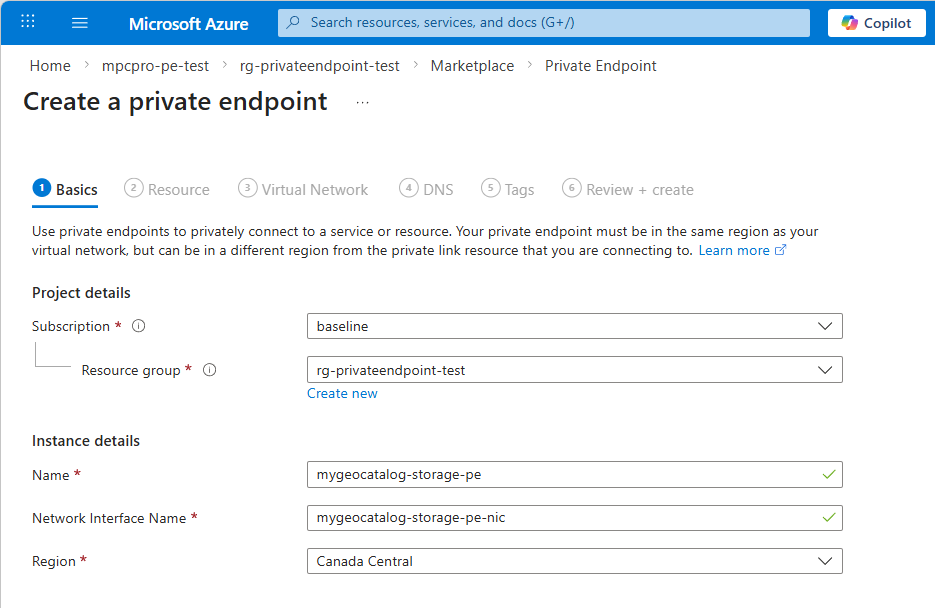
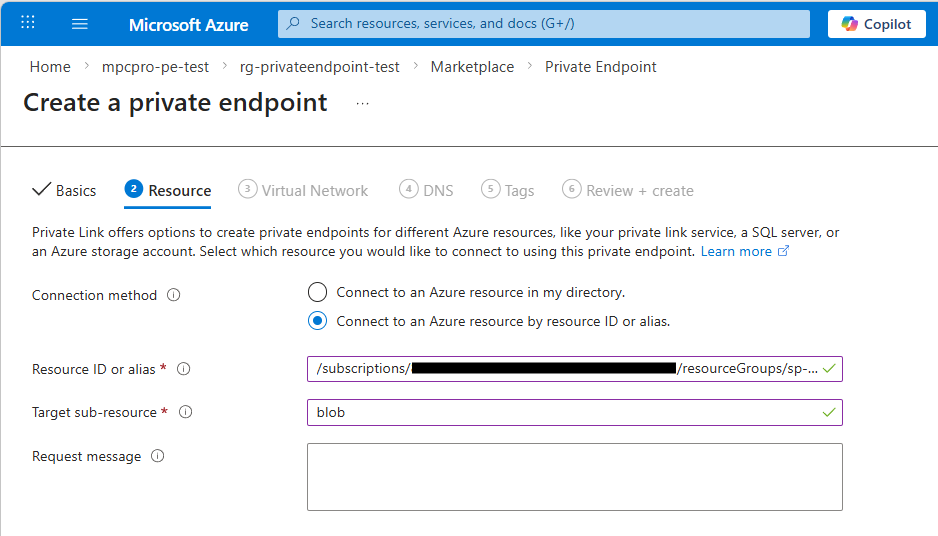
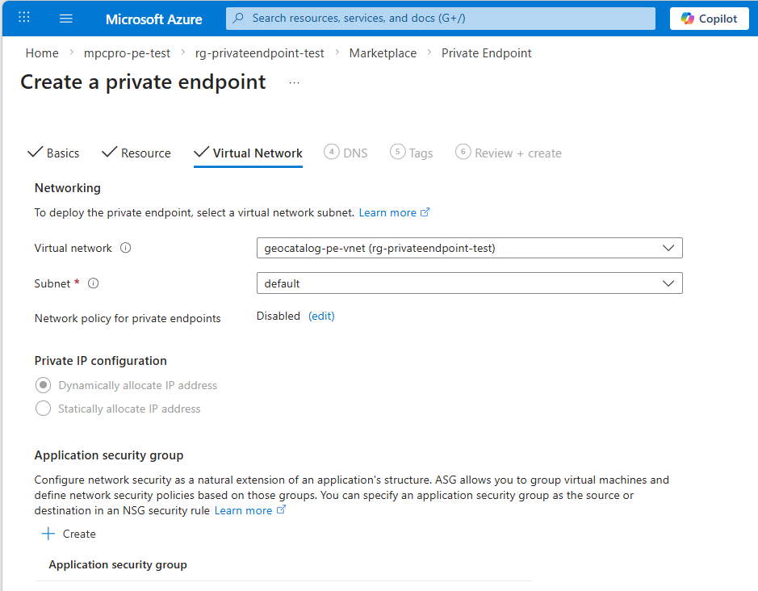
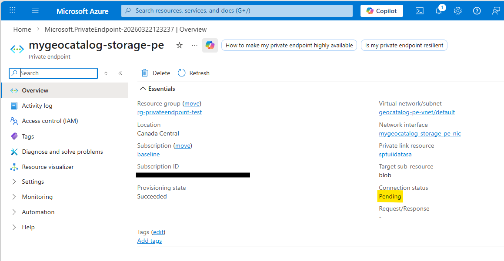
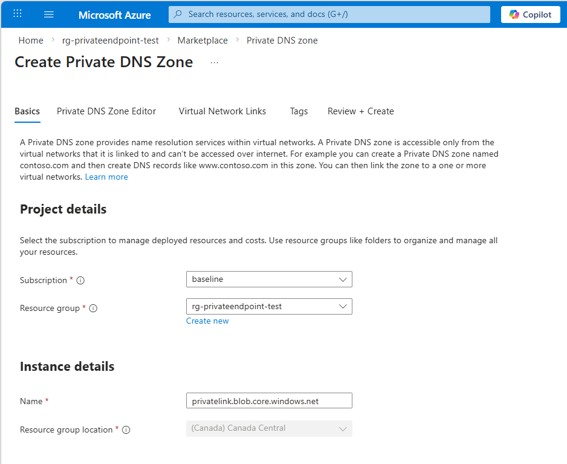
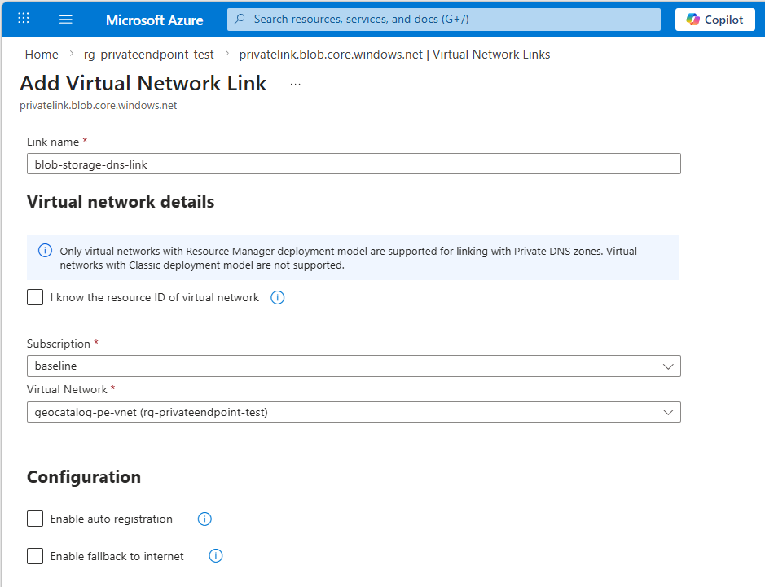
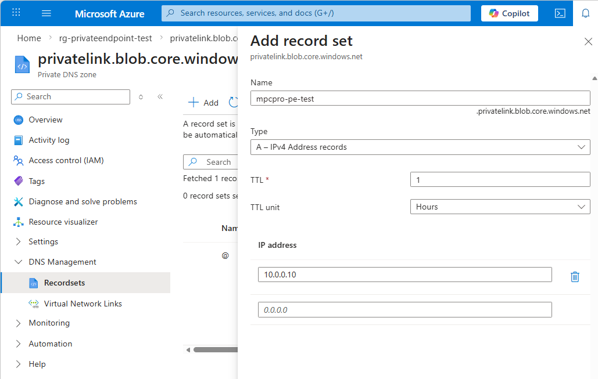

# Configure a private endpoint for GeoCatalog managed storage

This article explains how to create a private endpoint that provides private network access to the managed storage account behind your GeoCatalog resource. After configuration, blob data reads from within your virtual network travel over a private connection instead of the public internet.

Because GeoCatalog's managed storage account lives in a Microsoft-managed subscription, you connect to it by resource ID (instead of selecting it from the portal resource picker), and the connection requires approval from the GeoCatalog service team.

> [!NOTE]
> Private Link for GeoCatalog is currently in private preview.

## Prerequisites

- An existing [GeoCatalog resource](./deploy-geocatalog-resource.md)
- A virtual network with at least one subnet
- **GeoCatalog Admin** role on the GeoCatalog resource
- `Microsoft.Orbital` provider registered in your subscription
- Azure CLI (for the CLI steps)

## Discover the managed storage resource ID

Before creating the private endpoint, you need the managed storage account's resource ID. This ID is exposed on the GeoCatalog resource properties.

# [Azure portal](#tab/portal)

1. Navigate to your GeoCatalog resource from within the Azure Portal.
1. Select **JSON View** at the upper-right of the **Overview** pane.
1. Select `2025-07-01-preview` from the **API Versions** dropdown.

    > [!NOTE]
    > If this API version is not found in the list of available versions it means your subscription has not been allowlisted for the Private Link private preview feature. Please contact MPC Pro Support to add your subscription to the allowlist.

1. Find the **properties.managedStorageResourceIds** in the JSON view.

# [Azure CLI](#tab/cli)

### Bash

```bash
# Set variables
SUBSCRIPTION_ID="<your-subscription-id>"
RESOURCE_GROUP="<your-resource-group>"
GEOCATALOG_NAME="<your-geocatalog-name>"

# Get the managed storage resource ID
MANAGED_STORAGE_ID=$(az rest --method get \
  --uri "https://management.azure.com/subscriptions/${SUBSCRIPTION_ID}/resourceGroups/${RESOURCE_GROUP}/providers/Microsoft.Orbital/geoCatalogs/${GEOCATALOG_NAME}?api-version=2025-07-01-preview" \
  --query "properties.managedStorageResourceIds[0]" -o tsv)

echo "Managed storage ID: ${MANAGED_STORAGE_ID}"
```

### PowerShell

```powershell
# Set variables
$SUBSCRIPTION_ID = "<your-subscription-id>"
$RESOURCE_GROUP = "<your-resource-group>"
$GEOCATALOG_NAME = "<your-geocatalog-name>"

# Get the managed storage resource ID
$MANAGED_STORAGE_ID = az rest --method get `
  --uri "https://management.azure.com/subscriptions/$SUBSCRIPTION_ID/resourceGroups/$RESOURCE_GROUP/providers/Microsoft.Orbital/geoCatalogs/$GEOCATALOG_NAME`?api-version=2025-07-01-preview" `
  --query "properties.managedStorageResourceIds[0]" -o tsv

Write-Output "Managed storage ID: $MANAGED_STORAGE_ID"
```

---

The result is a resource ID in the format:

```
/subscriptions/<managed-sub>/resourceGroups/<managed-rg>/providers/Microsoft.Storage/storageAccounts/<managed-storage-name>
```

Record this value — you use it in the next step to create the private endpoint.


## Create the private endpoint

# [Azure portal](#tab/portal)

1. In the Azure portal, search for **Private endpoints** and select **Create**.

2. On the **Basics** tab:
   - Select your **Subscription** and **Resource group**.
   - Enter a **Name** for the private endpoint, for example: `mygeocatalog-storage-pe`.
   - Select the **Region** that matches your virtual network.

   [  ](media/create-storage-private-endpoint-basics.png#lightbox)

3. On the **Resource** tab:
   - For **Connection method**, select **Connect to an Azure resource by resource ID or alias**.
   - In the **Resource ID or alias** field, paste the managed storage resource ID you obtained earlier.
   - For **Target sub-resource**, enter **blob**.

   [  ](media/create-storage-private-endpoint-resource.png#lightbox)

4. On the **Virtual Network** tab:
   - Select the **Virtual network** and **Subnet** where the private endpoint should be created.

   [  ](media/create-storage-private-endpoint-virtualnetwork.png#lightbox)

5. On the **DNS** tab:
   - Set **Integrate with private DNS zone** to **Yes**.
   - Verify the DNS zone is set to `privatelink.blob.core.windows.net`.

6. Select **Review + create**, then select **Create**.

# [Azure CLI](#tab/cli)

### Bash

```bash
VNET_NAME="<your-vnet-name>"
SUBNET_NAME="<your-subnet-name>"
PE_NAME="<your-pe-name>"
LOCATION="<your-region>"

# Create the private endpoint using the managed storage resource ID
az network private-endpoint create \
  --name "${PE_NAME}" \
  --resource-group "${RESOURCE_GROUP}" \
  --vnet-name "${VNET_NAME}" \
  --subnet "${SUBNET_NAME}" \
  --private-connection-resource-id "${MANAGED_STORAGE_ID}" \
  --group-id "blob" \
  --connection-name "${PE_NAME}-connection" \
  --location "${LOCATION}" \
  --manual-request true \
  --request-message "Private endpoint for GeoCatalog managed storage"
```

### PowerShell

```powershell
$VNET_NAME = "<your-vnet-name>"
$SUBNET_NAME = "<your-subnet-name>"
$PE_NAME = "<your-pe-name>"
$LOCATION = "<your-region>"

az network private-endpoint create `
  --name $PE_NAME `
  --resource-group $RESOURCE_GROUP `
  --vnet-name $VNET_NAME `
  --subnet $SUBNET_NAME `
  --private-connection-resource-id $MANAGED_STORAGE_ID `
  --group-id "blob" `
  --connection-name "$PE_NAME-connection" `
  --location $LOCATION `
  --manual-request true `
  --request-message "Private endpoint for GeoCatalog managed storage"
```

> [!NOTE]
> The `--manual-request true` flag is required because the managed storage account is in a Microsoft-managed subscription. The endpoint is created in a **Pending** state and requires approval before traffic flows.

---

## Request approval for the connection

After creating the private endpoint, the connection is in a **Pending** state. Approval is handled by the GeoCatalog service team.

1. Verify the pending connection status:

   # [Azure portal](#tab/portal)

   Navigate to the private endpoint resource and check the **Private link connection status**. It should show **Pending**.

   [  ](media/create-storage-private-endpoint-pending-status.png#lightbox)

   # [Azure CLI](#tab/cli)

   ```bash
   az network private-endpoint show \
     --name "${PE_NAME}" \
     --resource-group "${RESOURCE_GROUP}" \
     --query "privateLinkServiceConnections[0].privateLinkServiceConnectionState.status" -o tsv
   ```

   ---

2. Contact your Microsoft account team or file a support request, providing:
   - Your GeoCatalog resource name and resource group
   - The private endpoint resource ID
   - The managed storage resource ID
   - If you file a support ticket Include "Private Endpoint Approval Request" in the subject

3. After approval, the connection status changes to **Approved** and traffic begins flowing over the private endpoint.

## Configure DNS

Create a private DNS zone for blob storage and link it to your virtual network.

# [Azure portal](#tab/portal)

1. In the Azure portal, search for **Private DNS zones** and select **Create**.
2. Set the **Name** to `privatelink.blob.core.windows.net`.

   [  ](media/create-storage-private-endpoint-create-dns-zone.png#lightbox)

3. After creation, select **Virtual network links** > **Add** and link the zone to your VNet.

   [  ](media/create-storage-private-endpoint-create-virtualnetwork-link.png#lightbox)

If automatic DNS integration was enabled during endpoint creation, the A record should already exist. Verify by checking the **Record sets** for an entry matching the managed storage account name.

   [  ](media/create-storage-private-endpoint-dns-add-recordset.png#lightbox)

# [Azure CLI](#tab/cli)

```bash
DNS_ZONE_NAME="privatelink.blob.core.windows.net"

# Create the private DNS zone (skip if it already exists)
az network private-dns zone create \
  --resource-group "${RESOURCE_GROUP}" \
  --name "${DNS_ZONE_NAME}"

# Link DNS zone to VNet
az network private-dns link vnet create \
  --resource-group "${RESOURCE_GROUP}" \
  --zone-name "${DNS_ZONE_NAME}" \
  --name "${VNET_NAME}-blob-link" \
  --virtual-network "${VNET_NAME}" \
  --registration-enabled false

# Get the private endpoint's IP address
PE_NIC_ID=$(az network private-endpoint show \
  --name "${PE_NAME}" \
  --resource-group "${RESOURCE_GROUP}" \
  --query "networkInterfaces[0].id" -o tsv)

PE_IP=$(az network nic show --ids "${PE_NIC_ID}" \
  --query "ipConfigurations[0].privateIPAddress" -o tsv)

# Extract the managed storage account name from the resource ID
STORAGE_NAME=$(echo "${MANAGED_STORAGE_ID}" | awk -F'/' '{print $NF}')

# Create A record
az network private-dns record-set a add-record \
  --resource-group "${RESOURCE_GROUP}" \
  --zone-name "${DNS_ZONE_NAME}" \
  --record-set-name "${STORAGE_NAME}" \
  --ipv4-address "${PE_IP}"
```

---

## Validate private access

After the private endpoint is approved and DNS is configured, validate the connection from a compute resource **inside your virtual network**.

1. Verify DNS resolution returns a private IP:

   ```bash
   nslookup <managed-storage-name>.blob.core.windows.net
   ```

   The response should resolve to an IP in the private range (for example, `10.0.1.x`) via `privatelink.blob.core.windows.net`.

## Troubleshooting

| Issue | Solution |
|-------|----------|
| Endpoint stuck in **Pending** | This is expected. Contact your Microsoft account team to approve the private link connection on the managed storage. |
| DNS resolves to a public IP | Verify `privatelink.blob.core.windows.net` is linked to your VNet and contains an A record for the storage account. |
| Access denied after approval | Ensure your identity has the **GeoCatalog Admin** role which inherits access to the managed storage. |
| `managedStorageResourceIds` is empty | Make sure to use API version `2025-07-01-preview` or later when querying the GeoCatalog resource. |

## Next steps

> [!div class="nextstepaction"]
> [Configure customer storage for private ingestion with GeoCatalog](./configure-trusted-services-customer-storage.md)

## Related content

- [What is Private Link for Microsoft Planetary Computer Pro?](./private-link-overview.md)
- [Configure a private endpoint for GeoCatalog data plane APIs](./configure-private-endpoint-data-plane.md)
- [Azure Private Link overview](/azure/private-link/private-link-overview)
- [Azure Storage network security](/azure/storage/common/storage-network-security)
