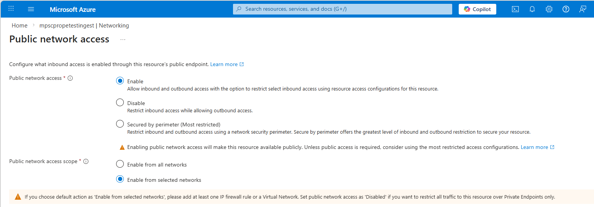

# Configure customer storage for private ingestion with GeoCatalog

This article shows you how to configure your Azure storage account so GeoCatalog can
ingest geospatial data from it even when the storage account firewall blocks public
access. The steps you need to follow depend on whether your storage account uses a
Private Endpoint.

## Choose your configuration path

While the Private Endpoint feature is in Preview, GeoCatalog supports ingestion from customer-managed Azure Blob Storage in two
networking configurations. Choose the path that matches your storage account:

| Configuration | Additional steps required |
|---|---|
| **Firewall only** (no Private Endpoint) | Follow the steps below to enable the trusted services bypass. No additional coordination with Microsoft is required. |
| **Firewall + Private Endpoint** | Follow the steps below to enable the trusted services bypass **and** complete a required support engagement with Microsoft before ingestion can succeed. |

> [!TIP]
> **Recommended configuration** — If your security requirements don't mandate a
> Private Endpoint on your storage account, the firewall-only configuration provides
> the simplest setup with no additional coordination with Microsoft. Private
> Endpoints are fully supported but require the extra steps described below.

### More Information on Private Endpoint Support

While Private Endpoint support for GeoCatalogs is in Preview, ingesting data from a customer-managed blob storage location with Private Endpoint support with GeoCatalog requires an additional manual configuration step by the GeoCatalog support team.  Ingestion **will not succeed** until Microsoft completes the required configuration on your behalf. 

This requirement applies under the following conditions:

- **Per storage account** — The configuration is applied to each individual storage
  account. If you switch to a different storage account or add additional storage
  accounts that use Private Endpoints, you must open a new support request for each
  one.
- **Trusted services bypass does not remove this requirement** — Enabling
  *Allow trusted Microsoft services to access this resource* is still required, but
  it alone is **not sufficient** when a Private Endpoint is present. You must still
  complete the support engagement.

### How to open the support request

1. In the Azure portal, navigate to your GeoCatalog resource.
1. Select **New support request** from the left menu.
1. Describe your scenario: you are configuring ingestion from a customer-managed
   storage account that has a Private Endpoint, and you need Microsoft to complete
   the required configuration.
1. Include the following details:
   - The **storage account name** and **resource group**
   - The **GeoCatalog resource name** and **region**
1. Wait for confirmation from Microsoft support that the configuration is complete
   before attempting ingestion.

> [!NOTE]
> Do not proceed with ingestion operations until Microsoft support
> confirms the configuration is complete. Ingestion attempts before that point will
> fail.

## Prerequisites

- An existing [GeoCatalog resource](./deploy-geocatalog-resource.md)
- An Azure storage account with geospatial data (STAC items with blob-hosted assets)
- **Storage Account Contributor** or **Owner** role on the storage account
- Azure CLI (for the CLI steps)
- **(Private Endpoint only)** Completed support engagement with Microsoft
  (see [More Information on Private Endpoint Support](#more-information-on-private-endpoint-support) above)

## Configure the storage firewall

First, enable the storage account firewall and allow the trusted services exception.

# [Azure portal](#tab/portal)

1. In the Azure portal, navigate to your storage account.
1. Select **Networking** from the left menu under **Security + networking**.
1. From the **Public access** tab, select **Manage** Under **Public network access**
1. Select **Enabled from selected networks** under **Public network access scope**.
1. Under **Exceptions**, check **Allow trusted Microsoft services to access this resource**.
1. Select **Save**.

   [  ](media/configure-customer-storage-manage-public-network-access.png#lightbox)

# [Azure CLI](#tab/cli)

### Bash

```bash
STORAGE_ACCOUNT="<your-storage-account>"
STORAGE_RESOURCE_GROUP="<your-storage-resource-group>"

# Set default action to Deny (blocks all public traffic)
az storage account update \
  --name "${STORAGE_ACCOUNT}" \
  --resource-group "${STORAGE_RESOURCE_GROUP}" \
  --default-action Deny \
  --bypass AzureServices
```

### PowerShell

```powershell
$STORAGE_ACCOUNT = "<your-storage-account>"
$STORAGE_RESOURCE_GROUP = "<your-storage-resource-group>"

az storage account update `
  --name $STORAGE_ACCOUNT `
  --resource-group $STORAGE_RESOURCE_GROUP `
  --default-action Deny `
  --bypass AzureServices
```

The `--bypass AzureServices` flag enables the trusted services exception. The `--default-action Deny` blocks all traffic that doesn't match a network rule.

---

## Verify the firewall configuration

Confirm the storage account is configured correctly before testing ingestion.

# [Azure portal](#tab/portal)

From the **Networking** blade, verify:

- **Public network access** is set to **Enabled from selected virtual networks and IP addresses**
- **Allow Azure services on the trusted services list** is checked
- No virtual networks or IP rules are listed (unless you have other requirements)

# [Azure CLI](#tab/cli)

### Bash

```bash
az storage account show \
  --name "${STORAGE_ACCOUNT}" \
  --resource-group "${STORAGE_RESOURCE_GROUP}" \
  --query "{defaultAction: networkRuleSet.defaultAction, bypass: networkRuleSet.bypass}" -o table
```

Expected output:

```
DefaultAction    Bypass
---------------  ---------------
Deny             AzureServices
```

### PowerShell

```powershell
az storage account show `
  --name $STORAGE_ACCOUNT `
  --resource-group $STORAGE_RESOURCE_GROUP `
  --query "{defaultAction: networkRuleSet.defaultAction, bypass: networkRuleSet.bypass}" -o table
```

---

## Test ingestion from the locked-down storage

With the firewall configured, test that GeoCatalog can ingest items with asset hrefs pointing to your storage account.

# [Azure portal](#tab/portal)

> [!NOTE]
> STAC item ingestion is not yet available through the Azure portal. Use the Azure CLI method.

# [Azure CLI](#tab/cli)

### Step 1: Create a collection (if needed)

```bash
GEOCATALOG_NAME="<your-geocatalog-name>"
GEOCATALOG_REGION="<your-geocatalog-region>"
GEOCATALOG_ENDPOINT="https://${GEOCATALOG_NAME}.${GEOCATALOG_REGION}.geocatalog.spatio.azure.net"

# Get an access token
TOKEN=$(az account get-access-token \
  --resource "https://geocatalog.spatio.azure.com" \
  --query accessToken -o tsv)

# Create a collection
curl -X POST "${GEOCATALOG_ENDPOINT}/stac/collections" \
  -H "Authorization: Bearer ${TOKEN}" \
  -H "Content-Type: application/json" \
  -d '{
    "id": "my-private-collection",
    "type": "Collection",
    "title": "Private Storage Test",
    "description": "Collection for testing ingestion from firewall-protected storage",
    "license": "proprietary",
    "extent": {
      "spatial": {"bbox": [[-180, -90, 180, 90]]},
      "temporal": {"interval": [["2024-01-01T00:00:00Z", null]]}
    },
    "links": []
  }'
```

### Step 2: Ingest a STAC item referencing the private storage

```bash
# Ingest an item whose assets point to the locked-down storage
curl -X POST "${GEOCATALOG_ENDPOINT}/stac/collections/my-private-collection/items" \
  -H "Authorization: Bearer ${TOKEN}" \
  -H "Content-Type: application/json" \
  -d '{
    "type": "Feature",
    "stac_version": "1.0.0",
    "id": "test-item-001",
    "geometry": {"type": "Point", "coordinates": [-105.0, 40.0]},
    "bbox": [-105.0, 40.0, -105.0, 40.0],
    "properties": {"datetime": "2024-01-01T00:00:00Z"},
    "collection": "my-private-collection",
    "links": [],
    "assets": {
      "data": {
        "href": "https://<your-storage-account>.blob.core.windows.net/<container>/<path-to-file>",
        "type": "image/tiff; application=geotiff"
      }
    }
  }'
```

### Step 3: Verify the item was ingested

```bash
curl -s "${GEOCATALOG_ENDPOINT}/stac/collections/my-private-collection/items/test-item-001" \
  -H "Authorization: Bearer ${TOKEN}" | python -m json.tool
```

If the item is returned with its assets, the trusted services bypass is working correctly — GeoCatalog was able to read from your storage account despite the firewall.

---

## Understanding how it works

When you ingest a STAC item into GeoCatalog, the service:

1. Reads the asset hrefs from the STAC item metadata.
2. Downloads the blob data from your storage account.
3. Copies the data into the GeoCatalog-managed storage account.
4. Updates the asset hrefs to point to the managed storage.

During step 2, Azure Storage checks whether the caller is a trusted Microsoft service. Because GeoCatalog is on the trusted services list, the read is allowed even with the firewall set to **Deny** by default.

> [!NOTE]
> The trusted services bypass only allows GeoCatalog to **read** from your storage
> account for ingestion purposes. It does not grant write or delete access.

> [!IMPORTANT]
> The trusted services bypass is necessary but **not sufficient** when your storage
> account has a Private Endpoint. If you have a Private Endpoint configured, you
> must also complete the [required support engagement](#how-to-open-the-support-request)
> before ingestion can succeed.

## Troubleshooting

| Issue | Solution |
|-------|----------|
| Ingestion fails and the storage account has a Private Endpoint | The most likely cause is that the required support configuration has not been completed. Open a new support request or reference your existing case. See [More Information on Private Endpoint Support](#more-information-on-private-endpoint-support). |
| Ingestion fails with 403 | Verify the `--bypass AzureServices` flag is set. Run `az storage account show` and check `networkRuleSet.bypass` includes `AzureServices`. If the storage account has a Private Endpoint, verify you have completed the required support engagement. |
| Ingestion was working but fails after switching storage accounts | The support configuration is applied per storage account. If you switched to a new storage account that has a Private Endpoint, you must open a new support request for that account. |
| Ingestion succeeds but assets aren't accessible | After ingestion, asset hrefs are rewritten to point to managed storage. Verify the ingested item's asset hrefs point to the managed storage account. |
| Items are in the collection but assets return 404 | The GeoCatalog may still be processing the data copy. Wait a few minutes and retry. |
| `Public access is not permitted on this storage account` when running `az storage` commands locally | This is expected — the firewall blocks your local machine. Add your IP address to the firewall rules, or use a VM inside a VNet with an allowed network rule. |

## Related content

- [Configure a private endpoint for GeoCatalog data plane APIs](./configure-private-endpoint-data-plane.md)
- [Configure a private endpoint for GeoCatalog managed storage](./configure-private-endpoint-managed-storage.md)
- [Azure Storage network security](/azure/storage/common/storage-network-security)
- [Trusted access for resources registered in your tenant](/azure/storage/common/storage-network-security#trusted-access-for-resources-registered-in-your-tenant)
