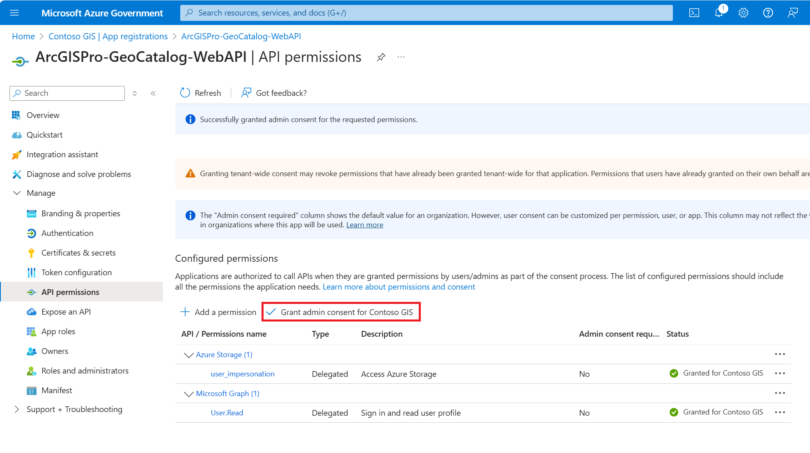
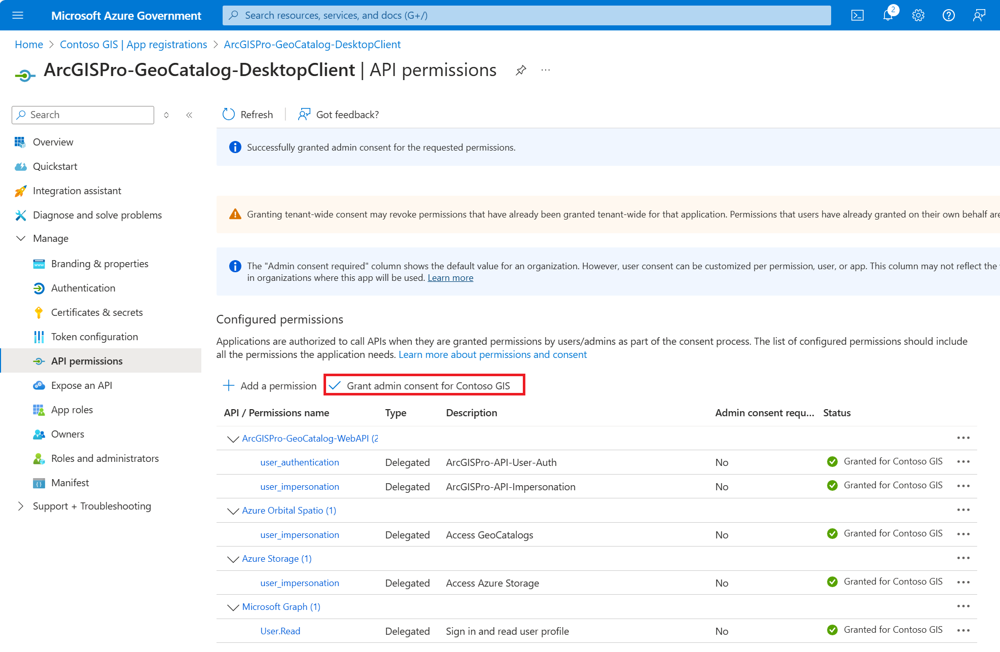

# Register ArcGIS Application with Azure and MPC Pro

## Overview

This folder contains resources and scripts to help you register ArcGIS applications with your Azure tenant and MPC Pro. The main goal is to enable ArcGIS Pro to access GeoCatalog resources securely through your organization's Azure environment.

## Contents

- `register_arcgis_app.py`: Python script to automate the registration of ArcGIS Web and Desktop applications in Azure AD.
- `web-app-config-template.json` and `desktop-client-app-config-template.json`: JSON templates for public cloud app registrations.
- `web-app-config-gov-template.json` and `desktop-client-app-config-gov-template.json`: JSON templates for US Gov cloud app registrations.

## Prerequisites

1. **GeoCatalog Resource Setup**: You must have already set up a GeoCatalog resource.
    - [Public Cloud](https://aka.ms/geocatalog)
    - [US Gov Cloud](https://aka.ms/ff/geocatalogs)
1. **Microsoft Entra Admin**: You must be an authorized Microsoft Entra (Azure AD) admin to register applications and grant permissions.

## Running the Script

It is recommended to run `register_arcgis_app.py` in the Azure Cloud Shell for best results.

### Accessing Azure Cloud Shell

1. Go to the [Azure Portal](https://portal.azure.com/) (or [Azure Gov Portal](https://portal.azure.us/) for US Gov cloud).
2. Click the Cloud Shell icon in the top navigation bar.
3. Choose Bash as your shell environment.
4. Upload the necessary files or clone your repository into the Cloud Shell environment.

### Executing the Script

Run the script with the required arguments.

**Public cloud:**

```bash
python3 register_arcgis_app.py \
  --cloud public \
  --web-app-template ./web-app-config-template.json \
  --desktop-app-template ./desktop-client-app-config-template.json
```

**US Gov cloud:**

```bash
python3 register_arcgis_app.py \
  --cloud usgov \
  --web-app-template ./web-app-config-gov-template.json \
  --desktop-app-template ./desktop-client-app-config-gov-template.json
```

## Post-Registration: Granting Admin Consent

After running the script, you must use the Azure Portal to grant admin consent for API permissions for both the Web and Desktop client applications:

1. Go to **Azure Portal > Microsoft Entra ID > Manage > App registrations**.
2. Find the newly created Web and Desktop client applications.
3. Under **API permissions**, click **Grant admin consent**.

**Screenshots:**




## Related Links

- [Use ArcGIS Pro with your organization's Azure AD](https://learn.microsoft.com/azure/planetary-computer/create-connection-arc-gis-pro)
- [ArcGIS Pro documentation](https://pro.arcgis.com/)
