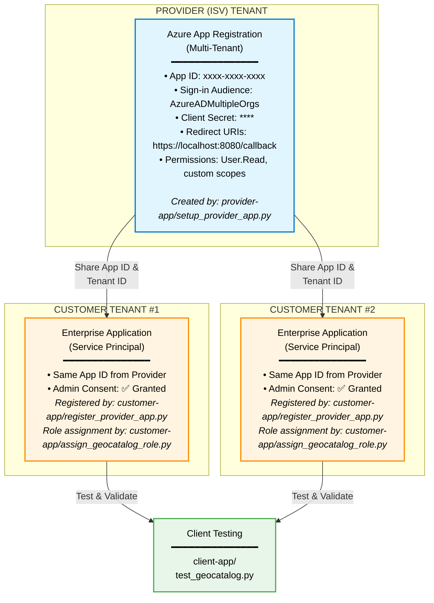

# Multi-Tenant Architecture Overview

## 🏗️ Architecture Diagram



## 🔄 Workflow

### Phase 1: Provider Setup (One-Time)
```
provider-app/
  └── setup_provider_app.py
      ├── Creates multi-tenant App Registration
      ├── Configures permissions
      ├── Generates client secret
      └── Outputs customer_onboarding.json
```

**Output**: Application ID, Tenant ID, Admin Consent URL

---

### Phase 2: Customer Onboarding (Per Customer)
```
customer-app/
  └── register_provider_app.py
      ├── Creates Service Principal in customer tenant
      ├── Requests admin consent (browser flow)
      └── Saves registration_info.json

  └── verify_setup.py
      └── Verifies configuration
```

**Output**: Enterprise app ready for customer users

---

### Phase 3: Testing & Validation
```
client-app/
  └── test_geocatalog.py
      ├── Tests authentication flows
      ├── Validates GeoCatalog access
      └── Demonstrates STAC API usage
```

---

## 📊 Key Concepts

### App Registration (Provider)
- Lives in **provider tenant**
- Created **once** by provider
- Configured for **multi-tenant** access
- Has client secret for confidential client flows

### Enterprise Application (Customer)
- Lives in **customer tenant**
- Created **per customer** during onboarding
- References the **same App ID** as provider
- Requires **admin consent**
- Can have different user assignments per customer

### Service Principal
- The representation of the app in a tenant
- In provider tenant: automatically created with App Registration
- In customer tenant: created during customer onboarding

---

## 🔐 Authentication Flows

### 1. Client Credentials (App-Only)
```
Provider App → Azure AD → Access Token → GeoCatalog
(Using Client Secret)
```

### 2. Authorization Code (Delegated)
```
User → Login → Consent → Provider App → Token → GeoCatalog
(On behalf of user)
```

### 3. Device Code (Delegated)
```
User → Device Code → Login → Provider App → Token → GeoCatalog
(For CLI/scripts)
```

---

## 🎯 Use Cases

### Provider Perspective
- Create **one** app registration
- Configure permissions **once**
- Share app details with **multiple customers**
- Manage secrets centrally

### Customer Perspective
- Receive app details from provider
- Admin grants consent **in their tenant**
- Assign **their users/groups**
- Maintain control over who can access

### End User Perspective
- Login with **their own credentials**
- Access granted through **their tenant**
- Provider app acts **on their behalf**
- Subject to **customer's policies** (MFA, Conditional Access, etc.)

---

## 💡 Benefits

1. **Centralized Management**: Provider manages one app, not N apps
2. **Customer Control**: Each customer controls user access
3. **Isolated Data**: Each customer's data stays in their tenant
4. **Scalable**: Add new customers without changing provider app
5. **Secure**: Leverages Azure AD security features
6. **Compliant**: Meets enterprise security requirements

---

## 📚 Related Documentation

- [Azure Multi-Tenant Applications](https://learn.microsoft.com/en-us/azure/active-directory/develop/single-and-multi-tenant-apps)
- [Service Principals](https://learn.microsoft.com/en-us/azure/active-directory/develop/app-objects-and-service-principals)
- [Admin Consent](https://learn.microsoft.com/en-us/azure/active-directory/manage-apps/configure-admin-consent-workflow)
