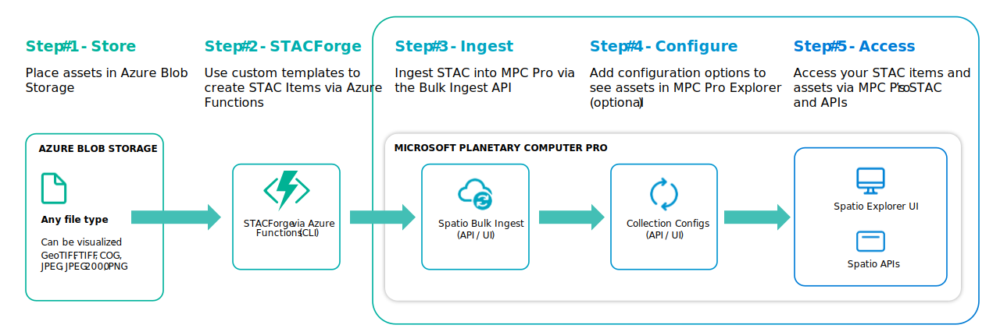

# STACForge

## Introduction

STACForge allows users to convert their own data formats into STAC Items using custom templates and ingest them into **Microsoft Planetary Computer Pro** (MPC Pro). It consists of a collection of [Azure Functions](https://learn.microsoft.com/en-us/azure/azure-functions/functions-overview?pivots=programming-language-python) and Python scripts designed to convert various data formats into [STAC](https://stacspec.org/) compliant formats.
<div style="text-align: center;">
  
</div>

Documentation for STACForge is provided in 3 sections:
* [**Deployment of STACForge**](#setup-and-deployment): Installation and Setup of local code and Azure Functions in cloud
* [**Running STACForge**](../stacforge-functions/doc/potsdam_tutorial.md): Execution of Azure Functions to create new STAC Items
* [**Building STACForge Templates**](../stacforge-functions/doc/templates.md): Guidance on creating new Jinja templates to forge new STAC items 

## Pre-requisites

The following resources and tools are required to deploy STACForge:

- [Azure Command Line Interface (CLI)](https://learn.microsoft.com/cli/azure/) (v2.64 or later)
- [Azure Functions Core Tools](https://github.com/Azure/azure-functions-core-tools) (v4.0.6280 or later)
- PowerShell v7.4 or later. See [Installing PowerShell on Windows](https://learn.microsoft.com/en-us/powershell/scripting/install/installing-powershell-on-windows?view=powershell-7.4) for more information.

**Please ensure the above pre-requisites are installed prior to proceeding through the remaining setup.**

## Setup

<!-- Update this to Github Endpoint -->

1. **Clone the repository:**
   ```bash
   git clone https://github.com/Azure/spatio-private-preview-docs.git
   ```

2. **Navigate to the Repository Directory:**
   ```bash
   cd spatio-private-preview-docs
   ```

3. **Install the pre-requisites either using Bash or Powershell script:**
   
   bash:
   ```bash
   ./tools/stacforge-functions/scripts/pre-requisites.sh
   ```
   powershell:
   ```pwsh
   ./tools/stacforge-functions/scripts/pre-requisites.ps1 
   ```

4. **Login to Azure:**
   ```azcli
   az login
   az account show -o table
   ```
   Optionally, run the following command if you're not on the right subscription:
   ```azcli
   az account set -s <subscription_id>
   ```

5. **Create `user_params.txt` file based on `default_params.txt` and update the values before running the setup:**

   ```psh
   Powershell:
   Copy-Item -Path .\tools\stacforge\scripts\default_params.txt -Destination .\tools\stacforge\scripts\user_params.txt -Force    
   ```
   ```bash
   Bash: 
   cp -rf ./src/tools/stacforge-functions/scripts/default_params.txt ./src/tools/stacforge-functions/scripts/user_params.txt
   ```


   In the `user_params.txt` file, make sure the following parameters are set:

   **resource_group**: Name of the Azure resource group to use for deploying stacforge. Ex: `rg-stacforge-dev`

   **location**: The Azure datacenter location to use for creating stacforge resources. Ex: `uksouth`

   **stacforge_name**: Name of the stacforge instance. This will be used in generating a unique string to name the stacforge resources. Ex: `devstacforge`

   **app_plan**: Function App Service Plan type. Default is 'flex'. The other plan is 'consumption'. [Comparison](https://learn.microsoft.com/en-us/azure/azure-functions/flex-consumption-plan#benefits)

   **source_storage_account**: Name of the storage account where the source data is available. Ex: `devstorage`. Once this is set, the newly created function will have read access to all data contained in this storage account. 


## Deployment

The Infrastructure can be deployed through a single [Powershell Script](#one-step-install-in-power-shell), or [Multi-Step using Bash](#multi-step-install-via-bash). Users may find the Powershell approach simpler, but either approach will lead to a succesful deployment. Please select only one approach. 

### One Step install in Power Shell

**Powershell:**
   ```pwsh
   Linux/macOS: 
   pwsh ./src/tools/stacforge-functions/scripts/Deploy-StacForge.ps1

Windows:
./tools/stacforge-functions/scripts/Deploy-StacForge.ps1  
```

Once deployed via Powershell, please move on to [Create STAC Items and Collections](#create-stac-items-and-collections)

----

### Multi-Step Install via Bash

*Warning: Do not run below this if you've installed via Powershell*

### Setup Script

1. Run the setup script to build the infrastructure for STACForge:

```bash
./src/tools/stacforge-functions/scripts/setup.sh
```

### Configure the resources

2. Run the configuration script:

```bash
./src/tools/stacforge-functions/scripts/configure.sh
```

### Deploy the Application

3. Run the deploy script to install the application:

```bash
./src/tools/stacforge-functions/scripts/deploy.sh
```

## Create STAC Items and Collections

Creating STAC Items & Collections require a valid dataset and a custom template. We have created a tutorial using Potsdam data. Follow the steps in the [tutorial](../stacforge-functions/doc/potsdam_tutorial.md) to create a collection.

## Ingestion

When the Collection json is ready, users can start ingesting the data into the target GeoCatalog instance. 
Follow the [documentation](https://github.com/Azure/spatio-private-preview-docs/blob/main/quickstarts/bulk-ingestion-api.md), which guides you running the bulk data ingestion using the API.


## Cleanup

Run the cleanup script to delete all the resources created above. 

```bash
./src/tools/stacforge-functions/scripts/cleanup.sh
```
