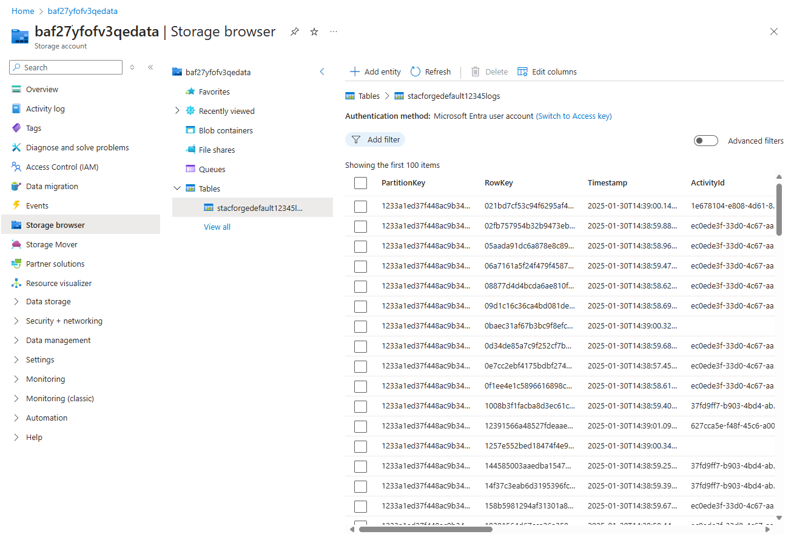
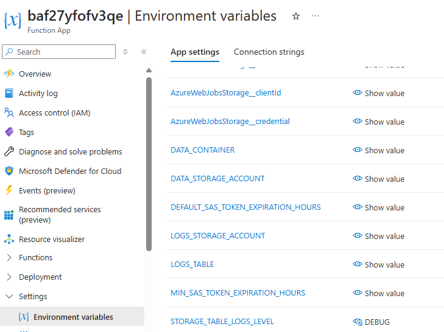

# STACForge Tutorial

This guide will walk you through the process of using STACForge by creating some new STAC Items from some sample data.

## Pre-requisites

* A working STACForge instance, see [STACForge Deployment](../README.md)
* A [GeoCatalog instance](https://github.com/Azure/spatio-private-preview-docs/blob/main/Deployment.md)

## Prepare a Dataset to Transform

To test STACForge, you will need a dataset to transform. In this guide we will use one of the datasets from the [International Society for Photogrammetry and Remote Sensing](https://www.isprs.org/) [Test Project on Urban Classification, 3D Building Reconstruction and Semantic Labeling](https://www.isprs.org/education/benchmarks/UrbanSemLab/default.aspx) benchmark. 
To download the dataset, click to the benchmark page, https://www.isprs.org/education/benchmarks/UrbanSemLab/default.aspx, and follow the instructions to download the *Potsdam* dataset.

*Note:* The dataset is large (13.3 GB), so it may take some time to download.

We are going to store the dataset in STACForge's data storage account (see [STACForge Deployment](deployment.md) for more details). You can recognize it because it's tagged as `storage-role`:`data`. Also, you can find it using the following command:

```cmd
az resource list --tag stacforge-name=<name of your stacforge> --tag storage-role=data --output table
```

Now, create a new container in the storage account to store the dataset. You can use the Azure CLI to create the container:

```cmd
az storage container create --name data --account-name <stacforge data storage account name> --auth-mode login
```

Extract the `potsdam.zip` file. Inside it you will find several ZIP files. Extract the `2_Ortho_RGB.zip` file and copy them to the container you created in the previous step. You can use the Azure CLI to upload the files:

```cmd
az storage blob upload-batch --account-name <stacforge data storage account> --destination data --destination-path potsdam --source <directory with 2_Ortho_RBG.zip files> --auth-mode login
```

76 files should be uploaded to the container.

## Templates

Ensure the templates are available under the `templates` container of the STACForge data storage account using the below command.

```azcli
az storage blob list --account-name <stacforge data storage account> --container-name templates --auth-mode login --output table
```

## Create a Target Collection

Open the GeoCatalog URL & create a collection named `potsdam-stacforge` using the following template:

```json
{
  "id": "potsdam-stacforge",
  "type": "Collection",
  "title": "Potsdam STACForge Test",
  "description": "Collection for testing STACForge with the Potsdam dataset",
  "item_assets": {
    "image": {
      "type": "image/tiff; application=geotiff; profile=cloud-optimized",
      "roles": [
        "data"
      ],
      "title": "Raster file"
    },
    "worldfile": {
      "type": "text/plain",
      "roles": [
        "metadata"
      ],
      "title": "World file"
    }
  },
  "license": "CC-BY-4.0",
  "extent": {
    "spatial": {
      "bbox": [[ -180, -90, 180, 90 ]]
    },
    "temporal": {
      "interval": [[ null, null ]]
    }
  },
  "links": [],
  "stac_version": "1.0.0"
}
```

Also, add the following render configuration:

```json
[
  {
    "id": "rgb",
    "name": "RGB",
    "description": "Visualize imagery as RGB",
    "type": "raster-tile",
    "options": "assets=image&asset_bidx=image|1,2,3",
    "minZoom": 13
  }
]
```

Apart from creating the collection, a credential is needed for the GeoCatalog to access the STACForge data container. You can create a shared access signature (SAS) token for the container using the following command:

```cmd
az storage container generate-sas --account-name <stacforge data storage account> --name data --permissions rl --start <start date> --expiry <expiration date> --auth-mode login --as-user --output tsv
```

Add the SAS Token credential to the GeoCatalog Credentials (Settings->Credentials).

## Execute the Transformation

To execute the transformation, execute the following command:

*Windows (PowerShell):*

```powershell
$FUNCTION_KEY = az functionapp keys list --resource-group <resource group of your stacforge> --name <name of your stacforge function app> --query functionKeys --output tsv
$FUNCTION_URL = "https://$(az functionapp show --resource-group <resource group of your stacforge> --name <name of your stacforge function app> --query properties.defaultHostName --output tsv)/api/orchestrations/geotemplate_bulk_transform?code=$FUNCTION_KEY"
$body = @{
  crawlingType = "file"
  sourceStorageAccountName = "<stacforge data storage account>"
  sourceContainerName = "data"
  pattern = "potsdam/*.tif"
  templateUrl = "https://<stacforge data storage account>.blob.core.windows.net/templates/potsdam.j2"
  targetCollectionId = "potsdam-stacforge"
}
$bodyJson = $body | ConvertTo-Json

Invoke-RestMethod -Uri $FUNCTION_URL -Method Post -Body $bodyJson -ContentType "application/json"

```

*Linux/macOS:*

```bash
FUNCTION_KEY=`az functionapp keys list --resource-group <resource group of your stacforge> --name <name of your stacforge function app> --query functionKeys --output tsv`
FUNCTION_URL=https://`az functionapp show --resource-group <resource group of your stacforge> --name <name of your stacforge function app> --query properties.defaultHostName --output tsv`/api/orchestrations/geotemplate_bulk_transform?code=$FUNCTION_KEY
curl -v -X POST $FUNCTION_URL --json @- << EOF
{
  "crawlingType": "file",
  "sourceStorageAccountName": "<stacforge data storage account>",
  "sourceContainerName": "data",
  "pattern": "potsdam/*.tif",
  "templateUrl": "https://<stacforge data storage account>.blob.core.windows.net/templates/potsdam.j2",
  "targetCollectionId": "potsdam-stacforge"
}
EOF
```

You will receive a JSON response containing the orchestration id and several URLs to monitor and manage the transformation. The endpoint named `statusQueryGetUri` can be used to query the status of the transformation. This endpoint is also returned in the `Location` header response.

> Watch out the URLs can be split in the terminal.

In the monitoring endpoint you can follow the status of the operation.

## Monitoring Execution and Logging

You can access STACForge logs in near-real-time. The orchestration and its activities creates logs in an Azure Storage Table located in the STACForge data storage account. The name of the table is the name of the STACForge with the `logs` suffix. 
<p align="center">
  
</p>

### The following columns are available:

| Column | Description |
| --- | --- |
| PartitionKey      | The id of the orchestration, use this column to filter the logs for a particular transformation execution. |
| RowKey            | A unique key created for each row. |
| Timestamp         | The time the log was stored. |
| ActivityId        | The id of the activity that created the log. |
| ActivityName      | The name of the activity that created the log. |
| Function          | The name of the function that created the log. |
| Level             | The log level, can be `INFO`, `WARNING`, `ERROR`, or `DEBUG`. |
| Message           | The log message. |
| Module            | The module that created the log. |
| OrchestrationName | The name of the orchestration. |
| Scene             | The scene being processed. |
| Time              | The time the log was created. |

## Ingestion

When the Collection json is ready, users can start ingesting the data into the target GeoCatalog instance. 
Follow the [documentation](https://github.com/Azure/spatio-private-preview-docs/blob/main/quickstarts/bulk-ingestion-api.md), which guides you running the bulk data ingestion using the API.

### Debugging and Troubleshooting Tips

If you are encountering errors while STACForge is running, examine the logs to determine where your Azure Function is failing. The Partition Key can be used to filter the logs to the most recent execution of STACForge. 

It is advisable to process a small amount of items first to ensure the template is executing propertly. 

STACForge has a DEBUG mode which increases the volume of logging data to assist with troubleshooting. This value can be set by navigating into the Azure Portal and finding your STACForge Function. On the left pane, select the **Settings** and then **Environmental variables** then edit the value for **STORAGE_TABLE_LOGS_LEVEL** and change it to **DEBUG** from **INFO**. 

<p align="left">
  
</p>

Once you are satisfied with the STAC Items produced by STAC Forge, it is recommended to change this Environmental variable back to **INFO** to reduce the amount of logging data. 

